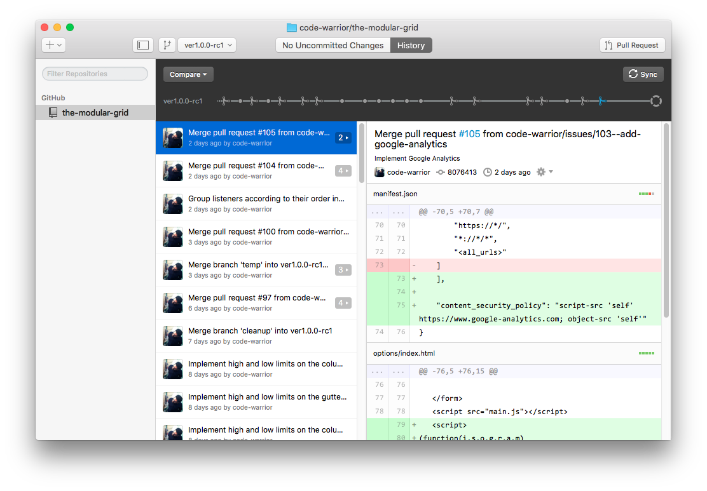
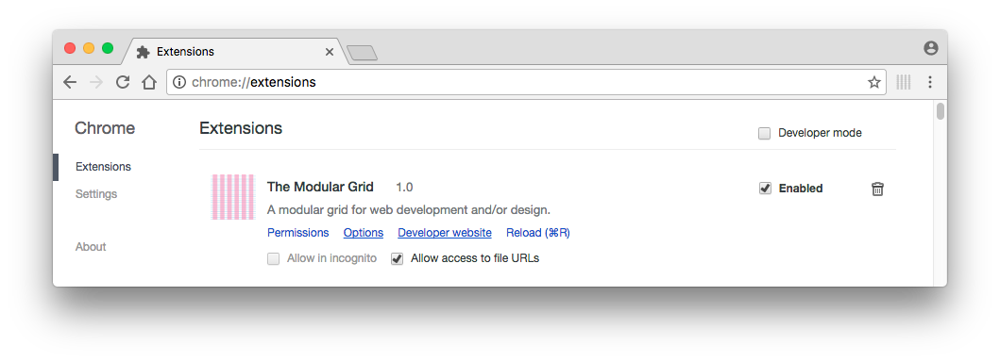

# The Modular Grid — A Chrome Extension
(v1.0.0)

This extension provides a series of grid overlays in web pages so web authors can better implement design translations into web pages. Some key options include the ability to change column widths and colors, gutter widths, and baseline/leading distances. The grid’s `options` page shows more, and feature requests are encouraged via GitHub issues.

- [Installation](#installation)
   * [Via GitHub Desktop Client](#github-desktop-installation)
   * [Via The Command Line](#command-line-installation)
- [Updates](#updates)
- [Keyboard Shortcuts](#keyboard-shortcuts)
- [Development](#development)
   * [Compiling](#development--compiling)
      * [Sass](#development--compiling__sass)
   * [Linting](#development--linting)
      * [Sass](#development--linting__sass)


## Beta Release Date
29 January 2017

## <a name="installation">Installing the Beta</a>
Installing this extension requires downloading a folder and “feeding” it to Chrome. I’ll discuss how to do this through the GitHub Desktop client and via a command line interface.

### <a name="github-desktop-installation">GitHub Desktop Installation</a>
(Burden: ~5 minutes)

1. Launch [GitHub Desktop](https://desktop.github.com/).

2. Load the repo into GitHub Desktop by clicking the appropriate link for your operating system.

   **Mac**: [`github-mac://openRepo/https://github.com/code-warrior/the-modular-grid`](github-mac://openRepo/https://github.com/code-warrior/the-modular-grid)

   **Windows**: [`github-windows://openRepo/https://github.com/code-warrior/the-modular-grid`](github-windows://openRepo/https://github.com/code-warrior/the-modular-grid)

3. Unless you choose a different name and location for the repo, click the blue `Clone` button.

      

4. You should see something akin to the following:

      

5. Open Chrome’s extensions page by typing [`chrome://extensions`](chrome://extensions) into the address bar, then open the folder into which you cloned the `the-modular-grid` repo from step 3.

      

6. Drag the `the-modular-grid` folder over the extensions page.
7. The extension is now installed.

      

### <a name="command-line-installation">Command Line Interface (CLI) Installation</a>
(Burden: ~2 minutes)

1. Launch your CLI and navigate to a folder into which to download the extension.
2. Clone the repository:

        git clone git@github.com:code-warrior/the-modular-grid

3. Switch to the version 1.0.0., release candidate 1 branch:

        git checkout ver1.0.0-rc1

4. Launch Chrome.
5. Type `chrome://extensions` into the address bar.
6. Locate the `the-modular-grid` folder that was created when you cloned this project in step `2`.
7. Drag the folder over the `Chrome Extensions` window.
8. A greyish, grid-like icon should now appear to the right of the address bar. Click it to toggle the grid on/off.

### <a name="updates">Updates</a>
Once the project is stable, it will be released via the Chrome Web Store. In the meantime, you can pull updates periodically. In your CLI, simply `git pull`, and in the GitHub Desktop client, click the `Sync` icon in the upper right hand corner.

### <a name="keyboard-shortcuts">Keyboard Shortcuts</a>
`Command+Shift+A` toggles the extension in Mac.

`Ctrl+Shift+A` toggles the extension in Windows 10.

`Ctrl+Shift+A` toggles the extension in Fedora Linux.

`Ctrl+Shift` toggles the sidebar info boxes in the upper right hand corner when the extension is enabled. This shortcut is universal across all operating systems.

## <a name="development">Development</a>

### <a name="development--compiling">Compiling</a>

#### <a name="development--compiling__sass">Sass</a>
````bash
\sass \
   --sourcemap=none \
   --unix-newlines \
   --no-cache \
   --style compressed \
   --watch content/main.scss:content/main.css \
      options/main.scss:options/main.css
````

### <a name="development--linting">Linting</a>

#### <a name="development--linting__sass">Sass</a>
````bash
sass-lint -c .sass-lint.yml -v -s .
````
